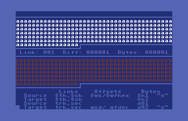

# DiffTool
Native c64 file diff tool. Its goals are to visually highlight differences between two files either on the same device and drive, or two different devices. It will log those differences to a SEQ file.

I'm using Jeff Hoag's [C64List 4.02](http://commodoreserver.com/BlogEntryView.asp?EID=8AA5A8C601114E8C8FEEC094A758FABA) for mixing BASIC and assembly code.

## Screenshot
